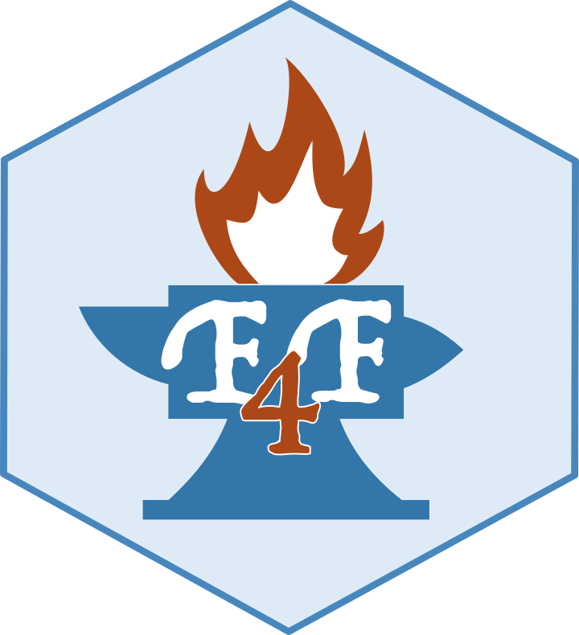

# F4F: Forge4Flame

<p align="center">
  
</p>

Shiny application to build a customised environment wit different rooms for flame ABM simulations

**A cellular biologist’s toolbox for data analysis.**

## Required Installed Packages

F4F is implemented in R Shiny. It requires several CRAN packages to operate: 

```
shiny-dashboard, shinyjs, jsonlite, dplyr, shinythemes, colourpicker, glue,
readr, zip, sortable, shinyalert, shinybusy, shinyBS, stringr, gg-plot2, tidyr, DT, shiny, shinyWidgets, shinyFiles, htmltools.
```

These packages are automatically installed.
Furthermore, it also requires the EBImage and the EBImageExtra packages. The user must install these packages manually using the following R commands:

```r
if (!requireNamespace ("BiocManager" , quietly = TRUE ))
install.packages("BiocManager")
BiocManager::install ("EBImage")

if (!requireNamespace ("remotes " , quietly = TRUE))
install.packages ( "remotes")
library (remotes)
install_github ("ornelles/EBImageExtra")
```


## How to Install
To install the F4F R package it is possible to use the R package devtools or remotes,through these R commands:

```r
if (!requireNamespace("devtools", quietly = TRUE))
install.packages("remotes")
library(devtools)
install_github("https://github.com/qBioTurin/FORGE4FLAME")
```
or:

```r
if (!requireNamespace("remotes", quietly = TRUE))
install.packages("remotes")
library(remotes)
install_github("https://github.com/qBioTurin/FORGE4FLAME")
```

## How to Run

### Without Docker
To run F4F without using Docker, the user can open the FORGE4FLAME.Rproj file with
RStudio—after cloning the repository—and run it through the Run App button or run the
following R commands after installing the package (see above):

```r
library(FORGE4FLAME)
FORGE4FLAME::FORGE4FLAME.run()
```

### With Docker

To run it using Docker, execute the following Bash command (if running on a server, ensure
that port 3839 is exposed and accessible via http://<server-hostname>:3839):

```
docker run -p 3839:3838 qbioturin/forge4flame
```
In this case, there is no need to download the F4F repository or install the package.


## Docker

Users can download the Docker images for both F4F and FLAME GPU 2 to avoid any potential dependency-related issues. In this context, the user must have Docker installed on their
computer. For more information, refer to [this document](https://docs.docker.com/engine/installation/).

Additionally, the user needs to ensure they have the necessary permissionsto run Docker without using sudo. To create the Docker group and add the user on a Unix
system, follow these steps:

• Create the docker group:
```
$ sudo groupadd docker
```

• Add user to the docker group:

```
$ sudo usermod -aG docker $USER
```

• Log out and log back in so that group membership is re-evaluated.

Additionally, the user must have the NVIDIA driver (installation instructions can be found [here](https://www.nvidia.com/en-us/drivers/)) and the NVIDIA container toolkit (installation instructions can be found [here](https://docs.nvidia.com/datacenter/cloud-native/container-toolkit/latest/install-guide.html)) installed.
To download the Docker images, run the following Bash commands:

```
docker pull qbioturin/forge4flame
docker pull qbioturin/flamegpu2
```

An alternative method for downloading Docker images is via F4F, provided that the user has
installed the R package.

```
library(FORGE4FLAME)
FORGE4FLAME::downloadContainers()
```

## Docker compose

To use the Docker Compose, the user must download the YAML file [here](https://github.com/qBioTurin/FORGE4FLAME/blob/main/inst/Compose/docker-compose.yml). To start both F4F
and FLAME GPU 2 containers, navigate to the directory containing the YAML file and run the
following Bash command (if running on a server, ensure that port 3839 is exposed and accessible
via http://<server-hostname>:3839; if running locally, access to http://localhost:3839):

```
docker compose up -d --build
```

To run a FLAME GPU 2 simulation using Docker Compose, the user must use the Run
page of F4F. Results will be saved in a directory named \
results/CustomModel \
within the current directory.
To stop the containers, run the following Bash command:

```
docker compose down
```

# FLAMEGPU2 

To install FLAME GPU 2 dependencies, refer to the official documentation [here](https://github.com/FLAMEGPU/FLAMEGPU2).

## Run without docker

To run FLAME GPU 2 without using Docker, run the following Bash command (inside the FORGE4FLAME/inst/FLAMEGPU-FORGE4FLAME directory, after cloning the F4F repository):

```
# Executing a single run without using the FLAMEGPU2 3D visualization :

./abm.sh -expdir NameOfTheModel

######################## ##### ##### ##### ##### ##### ###### ######

# Executing a single run using the FLAMEGPU2 3D visualization :

./abm.sh -expdir NameOfTheModel -v ON

######################## ##### ##### ##### ##### ##### ###### ######

# Executing n runs without using the FLAMEGPU2 3D visualization :

./abm_ensemble.sh -expdir NameOfTheModel

######################## ##### ##### ##### ##### ##### ###### ######
# Visualize the helper :

./abm.sh -h
./abm_ensemble . sh -h

```

In particular, NameOfTheModel must be the name of the desired model and must correspond to a directory within \
FORGE4FLAME/inst/FLAMEGPU-FORGE4FLAME/resources/f4f \
that contains both a JSON file and an RDs file. If the user utilizes the Link the model to FLAMEGPU2 button, the directory with the provided name
will be automatically saved in the correct location. Otherwise, if the user downloads the
model using the Save the model button, they must manually copy the unzipped directory into \
FORGE4FLAME/inst/FLAMEGPU-FORGE4FLAME/resources/f4f.

## Run with docker

To run FLAME GPU 2 using Docker, run the following Bash commands:

```
# Executing a single run without using the FLAMEGPU2 3D visualization :

docker run --user $UID:$UID --rm --gpus all --runtime nvidia -v AbsolutePathToTheDirectoryWithTheModel:/home/docker/flamegpu2/FLAMEGPU-FORGE4FLAME/resources/f4f/CustomModel -v $(pwd):/home/docker/flamegpu2/FLAMEGPU-FORGE4FLAME/flamegpu2_results qbioturin/flamegpu2/usr/bin/bash -c "/home/docker/flamegpu2/FLAMEGPU-FORGE4FLAME/abm.sh - expdir CustomModel"

######################## ##### ##### ##### ##### ##### ###### ######
# Executing n runs without using the FLAMEGPU2 3D visualization :

docker run --user $UID:$UID --rm --gpus all --runtime nvidia -v AbsolutePathToTheDirectoryWithTheModel:/home/docker/flamegpu2/FLAMEGPU-FORGE4FLAME/resources/f4f/CustomModel -v $(pwd):/home/docker/flamegpu2/FLAMEGPU-FORGE4FLAME/flamegpu2_results
qbioturin/flamegpu2/usr/bin/bash -c "/home/docker/flamegpu2/FLAMEGPU-FORGE4FLAME/abm_ensemble.sh -expdir CustomModel"
```

In this case, there is no need to download the F4F repository or install the package.
AbsolutePathToTheDirectoryWithTheModel represents the absolute path to the local directory that contains the model to run (the JSON and the RDs files). These files will be saved in a
directory named CustomModel inside the Docker (in FLAMEGPU-FORGE4FLAME/resources/f4f).
Results will be saved in a directory named results/CustomModel within the current directory.

# How to reproduce the results

To reproduce the results presented in the main document—comparing FLAMEGPU2 and
NetLogo using the ITP and the alert scenarios—run the following Bash commands (note that
this process may take time, especially for NetLogo):

```
git clone --recurse -submodules git@github.com:qBioTurin/FLAMEGPU-FORGE4FLAME.git
git checkout School

# Reproduce results on comparison between FLAME GPU 2 and NetLogo:

./reproduce_comparison.sh

# Reproduce results on alert scenarios:

./reproduce_alert.sh
```


<p align="center">
  <a href="https://qbio.di.unito.it/">
    
  </a>
</p>

## Diclaimer:
F4F developers have no liability for any use of F4F functions, including without limitation, any loss of data, incorrect results, or any costs, liabilities, or damages that result from the use of F4F. 

## How to cite

```
Nature
```

